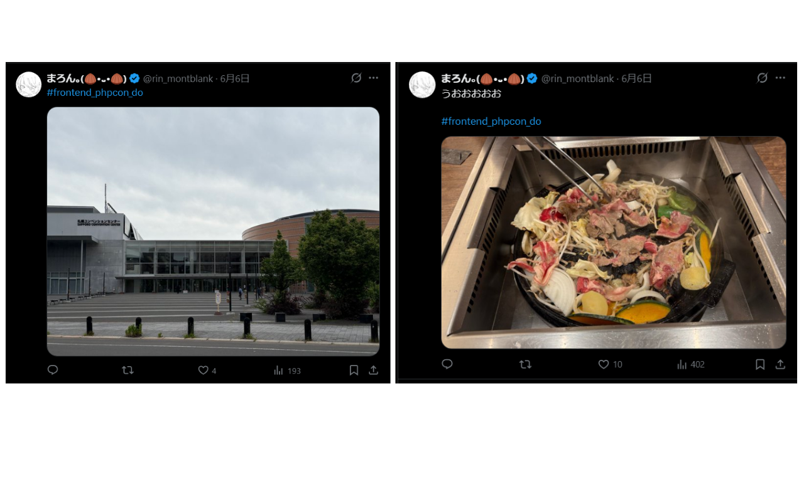
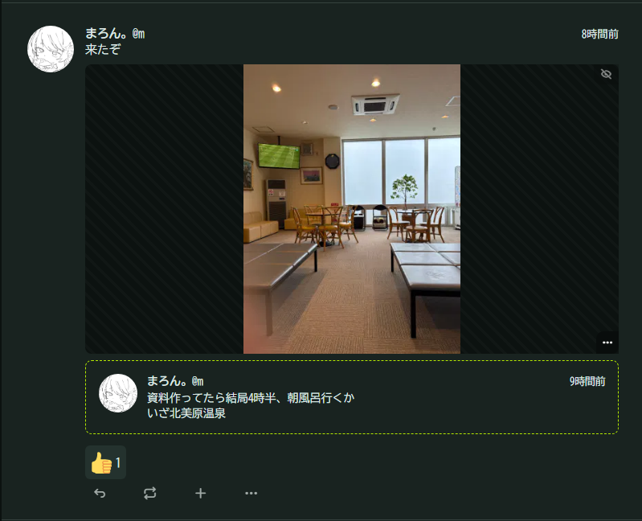
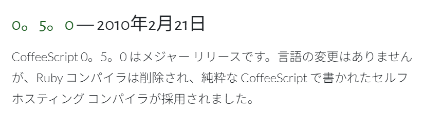

<style>
section { font-family: "Noto Sans JP", "Helvetica Neue", Arial, sans-serif; }
h1 { font-size: 56px; margin-bottom: 8px; }
h2 { color: #2b8bf2; }
.footnote { font-size: 12px; color: #666; }
</style>

はこだて未来大×企業エンジニア 大LT2026
# 他の言語をRubyっぽくしてみた

<!--

- 挨拶・名乗り
- タイトル紹介「他の言語をRubyっぽくしてみた」
- ふざけてるけど本気で作ったツールの話、と前置き
- 5分間よろしく

-->

---

## 自己紹介

<style scoped>
li { font-size: 0.9em; }
img.qr { position: absolute; top: 0; right: 0; height: 260px; }
</style>


- まろん｡ / 村田凜空
- Likes:
  - アマチュア言語処理系
  - JavaScript・AltJS(CoffeeScript等)
  - ネタ開発
  - OSS活動
- Links:
  - https://montblank.fun/
  - Twitter(旧X): [rin_montblank](https://twitter.com/rin_montblank)
  - Misskey: [@m@misskey.otnc.dev](https://misskey.otnc.dev/@m)
  - GitHub: [otnc](https://github.com/otnc)


<!--

- 名前
- 趣味は散策・食事・開発

-->

---

## 自己紹介 ― 最近の活動・趣味

旅行


<!--

- 道内旅行をしていた
- 画像は平取町のすずらん鑑賞会、夕張市にある初音橋、小樽市内のショップ

-->

---

## 自己紹介 ― 最近の活動・趣味

技術カンファレンスに参加



<!--

- 先々週フロントエンド・PHPカンファレンスに参加

-->

---

## 自己紹介 ― 最近の活動・趣味

温泉


<!--

- 気が向けば温泉

-->

---

## 自己紹介 ― 最近の活動・趣味

今朝



---

# 本編

---

<style scoped>
li { font-size: 1.5em; }
</style>

## 目次

- 概要
- デモ
- まとめ

<!--

- 今日の流れ：概要→デモ→まとめ
- 概要が一番のネタ、と期待を煽る

-->

---

## RubyKaigi 2026に参加した

Staff(Helper)として参加
諸事情で2日目から不在
(1日目のみ参加)
いくつかの発表を聴いた


<!--

- RubyKaigi 2026にスタッフ(ヘルパー)で参加
- 諸事情で実質1日目だけ

-->

---

# 参加して、思った

<!--

- RubyKaigiで発表を聞いて、思った

-->

---

# Ruby触りたいなぁ…

<!--

- 「Ruby触りたい」という気持ち
- あの雰囲気に influenced される、と共感を誘う

-->

---

## でも、ﾒﾝﾄﾞｸｻｲ

- プログラミング言語のここがめんどくさい
  - 学ぶ・覚える
    - 文法
    - 主要ライブラリ
  - 使う機会がない
    - それ既に知ってる別の言語でよくない？

<!--

- 新しい言語は覚えることが多い（文法・ライブラリを学び直し）
- 普段は別の言語なので出番がない
- 「それ既に知ってる言語でよくない？」が現実

-->

---

# そこで、

---

## 発想の転換

他の言語をRubyっぽく見せれば実質Rubyでは

<!--

- 発想の転換：学ぶのが大変なら学ばない
- 他の言語をRubyっぽく「見せれば」実質Ruby、という主張

-->

---

## やってみる

- 普段からよく使用するJavaScriptとCoffeeScriptで試してみる

<!--

- 普段からよく触ってる言語で試してみる

-->

---

## それぞれの言語

### JavaScript

- `console.log` で出力する
- `{` `}` でブロックを表現する(インデントベースではない)
- Rubyと同時期に公開

<!--

- `console.log` がログ出力
- 波括弧でブロックを表現する点がRubyっぽくない
- Rubyっぽくするのは難しそう

-->

---

## それぞれの言語

### CoffeeScript

- AltJSの一種
- Ruby, Python, Haskellなどに影響されている(インデントベース)
- `v0.5.0` 以前はRuby製のコンパイラを使用していた
  

<!--

- AltJSの一種なので関数名などはJavaScriptと一致
- インデントベースの文法、関数型言語を取り入れられている
- Rubyっぽくできそう

-->

---

## エアプが考えるRubyの特徴

- `puts` , `p` 等で出力する
- インデントベース
- `end` がつく

<!--

- Rubyのコードを触ったことのない人(自分)が読んでパッと感じた印象
- puts・インデントベース・end
- この特徴を順番に偽装していく
- 大きく「関数の偽装」と「文法の偽装」の2フェーズで攻める

-->

---

## フェーズ1：関数を偽装

`console.log` … どう見てもJS

<style scoped>pre { font-size: 0.55em; }</style>

```js
console.log("hi, " + name);
```

:arrow_down: `puts` … Rubyっぽい

```js
puts("hi, " + name);
```

<!--

- まずフェーズ1、関数の偽装
- console.log を puts に差し替えるだけでちょっとRubyにみえませんか、少なくともJSからはほんのちょっと遠のいたような…
- 慣習的にはRubyの関数呼び出しに括弧はいらないというツッコミは一旦無視します

-->

---

## フェーズ1：関数を偽装

```js
function greet(name) {
  if (!name) {
    return "hello";
  }
  return "hi, " + name;
}
console.log(greet("marron."));
```

:arrow_down:

```js
function greet(name) {
  if (!name) {
    return "hello";
  }
  return "hi, " + name;
}
puts(greet("marron."));
```

<!--

- でも puts なんてJSに無いので

-->

---

## 種明かし

事前に定義
`puts` はほぼ `console.log` のwrap

```js
const { puts } = require("fxxkinmethod/ruby");
```

実装イメージ

```js
// fxxkinmethod/ruby
export const puts = (...args) => {
  /* 中身はただの console.log */
  console.log(...args);
};
```

<!--

- puts はライブラリで生やしているだけ
- 無ければ作ればいい
- 中身はほぼ console.log のラッパー
- 名前を puts に変えただけ
- 関数の偽装はこれで完成、次は文法（フェーズ2）へ

-->

---

## フェーズ2：文法を偽装

インデントベースに見せかける（括弧・セミコロンを消す）

<style scoped>pre { font-size: 0.8em; }</style>

```js
function greet(name) {
  if (!name) {
    return "hello";
  }
  return "hi, " + name;
}
puts(greet("marron."));
```

:arrow_down:

```js
function greet(name)
  if (!name)
    return "hello"
  return "hi, " + name
puts(greet("marron."))
```

<!--

- 次は大きく見た目をごまかします
- 上：括弧・セミコロンだらけ／下：インデントだけのスッキリ
- だいぶRubyに近づいた、と振る

-->

---

## フェーズ2：文法を偽装

仕上げに `end` を付ける

<style scoped>pre { font-size: 1.2em; }</style>

```js
function greet(name)
  if (!name)
    return "hello"
  end
  return "hi, " + name
end

// ...
```

もう完全にRubyの見た目 … でも、これ本当に動くの？

<!--

- 仕上げにendをつける
- もう完全にRubyの見た目
- でも元はJavaScript、括弧もセミコロンも消えてる
- JSの文法的に間違っている → 本当に動くのか？

-->

---

## 種明かし

括弧もセミコロンも画面の右端に追いやってるだけ

<style scoped>pre { font-size: 1.6em; }</style>

```js
                                                  let end=null;
function greet(name)                              {
  if (!name)                                      {
    return "hello"                                ;}
  end
  return "hi, " + name                            ;}
end

// ...
```

:arrow_right: 中身は元の言語のまま。なので動く

<!--

- 横スクロールするとが右端になんかある
- 消したのではなく見えない場所に追いやっただけ、都合の悪いものは隠す
- `end` も適当に `= null` (nullを代入) してコード内に配置
- 中身は元のJavaScriptのままなので元のコード同様に動く

-->

---

## フェーズ3：自動化・デモ

手動でインデントをそろえたりするのは面倒 :arrow_right: **ツールにやらせる**

他の言語のコードをインデントベース言語(風)に変換するツールを作成した

**indentier**

 

<!--

- 関数はともかく、インデントをチマチマ操作するのはめんどくさい
- 文法偽装を自動化する
- そこでindentierという他言語をインデントベース言語「風」に変換するツールを作った
- 名前と仕様はPrettier由来

-->

---

<style scoped>
h2 { margin-bottom: 6px; }
p { margin: 4px 0; }
code { font-size: 0.7em; }
pre { margin: 6px 0; }
pre code {
  font-size: 0.55em;
  line-height: 1.3;
}
</style>

## indentier について

Prettier とほぼ同じコマンドの使い方、設定ファイルの項目

`npm install -D indentier`
`npx indentier --write ./src/ --mode ruby`

今回のデモで使用する例 `.indentierrc.json`

```jsonc
{
  "mode": "default", "tabWidth": 2, "useTabs": false,
  "offset": 20, "minColumn": 60,
  "brackets": true, "semicolon": true, "comma": true,
  "ruby": { "variableName": "end", "injectDeclaration": true, "smartEnd": true },
  "plugins": ["@indentier/plugin-coffee"]
}
```

---

## indentier の実装(簡易)

各行末の記号を正規表現で取り出して右端に隠す

- AST構築等は無し、テキスト処理のみ
- `end` の挿入：`{` と `}` の対応を追いかけて、`if` や `function` のブロックが閉じているところに `end` を差し込む

```js
function greet(name)                                        {
  if (!name)                                                {
    return "hello"                                          ;} // <--
  end
  return "hi, " + name                                      ;} // <--
end
```

<!--

- ASTを使わず正規表現でテキストを処理しているだけ
- end注入：{ が来たらスタックに積む、} が来たら取り出す。その } がブロック(if/function等)なら end を追加

-->

---

# デモ

<!--

- scripts/demo.mjs / scripts/run-origin.mjs / scripts/run-converted.mjs の説明
- 変換前のコードを見せる
- 変換前のコードを実行 (npm run do:origin)
- npm run demo
- 変換後のコードを見せる
- 変換後のコードを実行 (npm run do:converted)

-->

---

## デモ結果

関数偽装（fxxkinmethod）× 文法偽装（indentier）

:arrow_right: Rubyの見た目っぽくなった、しかもそのまま動く

---

## 無理だったこと・難しかったこと

- 言語の制約
  - JS/TS/Coffee
    マクロ機構がない :arrow_right: `def` などの新しい構文を導入できない
    `do` がすでに**予約語** :arrow_right: `do...end` 構文作れない
- 言語の自由さ
  - インデントベースではない言語は書き方の自由度が高い
    :arrow_right: パースとその後の処理がうまくいかないケースがあった
    (見られたケースは修正済みだがまだあるかも)
  - 正規表現では限界があるかも

<!--

- ここからは「うまくいかなかったこと」
- JS/TS/Coffee にはマクロが無いので `def` のような新構文は作れない
  - `end` は `end = null` で誤魔化せたが、`def greet(name)` は同じ手が使えない
- `do` は予約語なので `do = null` すらできず、Rubyの `do...end` ブロックは再現できなかった
- 「見た目だけRuby」にも言語仕様の限界がある

-->

---

# まとめ

---

<style scoped>
#big p {
  font-size: 9vw;
  font-weight: 1000;
}
</style>

こんなもの作ってる暇があるなら、

<div id="big">

Rubyを学ぼう:bangbang:

</div>

<!--

- indentier作ってる時間で普通に学べた気がする

-->

---

## ありがとうございました

### 今回作ったモノ

<style scoped>
li { font-size: 0.8em; }
</style>

- 今回のスライドとコード
  https://github.com/oto-lt/ltfes2026_fun

- 簡易関数偽装ライブラリ
  https://github.com/otnc/fxxkinmethod
  https://www.npmjs.com/package/fxxkinmethod
  
  ```bash
  npm install fxxkinmethod
  ```

- 簡易文法偽装自動化ライブラリ
  https://github.com/indentier/indentier
  https://www.npmjs.com/package/indentier
  
  ```bash
  npm install indentier
  ```


<!--

- RubyKaigiでRubyを書きたくなった／でも学習コストが高い
- なら見た目だけRubyにすればいい、という発想
- やってることは括弧を右端へ＋end を足すだけ、中身は動く
- ネタだけどnpm公開済み、ぜひ使ってと締める

-->
